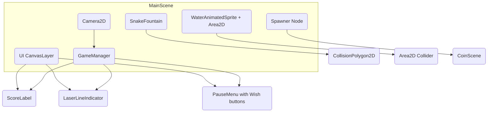
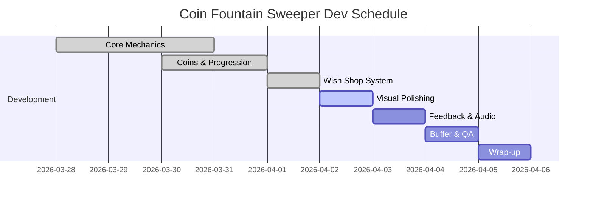

# Executive Summary

This document updates the **Coin Fountain Sweeper** Game Design Document (GDD) to include all implemented changes. The core game remains a physics-based 2D micromanagement title in Godot 4, but key mechanics have evolved: the **fail-state** now uses a *water displacement* system, the **Wish System** is now a player-driven shop economy, coin roles and scoring have been tiered, difficulty progresses in phases, input uses larger hitboxes for accessibility, and visuals/juice have been enhanced. This GDD outlines these changes in detail, with precise formulas, node architecture, code snippets, and a practical 7-day solo dev schedule. Following the GDD, a README provides project setup and run instructions. 

## 1. Game Overview  
The player manages an overflowing wishing fountain by clicking on falling coins. Each coin (Bronze, Silver, Gold) both adds to the fountain’s water level when it lands and grants Favor (score) when clicked. The fountain will overflow (Game Over) if the water height reaches the glowing Laser Line at **Y=250**. The player’s goal is to keep the water under control while using Favor to purchase powerful Lifelines from a **Wish Shop**. Real-time micromanagement and prioritization are key: heavy coins crush the pile but yield more Favor, bouncy coins add chaos, and strategic use of Wishes (lifelines) can avert disaster. Visual and audio feedback (coin pops, camera shake, pulsing lights) make each interaction satisfying, reinforcing the “game feel” as players juggle tasks under pressure【52†L278-L287】【38†L24-L30】.

## 2. Core Game Loop  
1. **Coin Spawn:** A Timer spawns coins above the fountain. Spawn logic follows a **phased progression**: Phase 1 (0–15s) spawns only Bronze coins, Phase 2 (15–35s) introduces Silver, and Phase 3 (35s+) adds Gold. Simultaneously, the spawn interval decreases gradually (down to a floor of 0.25s, i.e. 4 coins/sec).  
2. **Physics Interaction:** Coins are `RigidBody2D` nodes (see Architecture). They fall with gravity and bounce off the fountain walls and each other. Bronze coins have moderate bounce, Silver are very bouncy, Gold are heavy and nearly non-bouncy【48†L310-L318】. Collisions are realistic due to precise collision shapes.  
3. **Water Level Update:** Each coin has a `water_increase` value (e.g. Bronze=5px, Silver=10px, Gold=15px). When a coin enters the fountain’s water area (`Area2D`), the fountain’s `water_height` target is increased by that value via a smooth `lerp()` tween. This raises the animated water surface accordingly.  
4. **Player Interaction (Clicks):** The player clicks or taps coins to remove them. Each coin also has a large invisible hitbox (`Area2D` ~2× sprite radius) to ease clicking (Tier 1 “fat-finger” input). Upon click, the coin pops (plays VFX/SFX), is freed, and the water height is decreased by the coin’s value (instantly or via a short tween), simulating water removal. The player earns Favor: Bronze +1, Silver +3, Gold +5.  
5. **Fail Check:** Each frame, the game checks if `water_height ≥ 250` (Laser Line). If so, Game Over triggers immediately. A brief warning effect (like water bubbling or UI flash) can play as `water_height` nears the line.  
6. **Wish Shop Access:** The player can pause anytime to open the Wish Shop. Here they spend Favor on Lifelines (the new Wish System). These are one-off effects (e.g. *Fountain Sweep* clears all coins). Choosing when to use these adds a strategic layer.  

This loop ensures constant decision-making: click threats, manage water, and decide on Lifelines. It ties closely to the jam theme of micromanagement by forcing continual small interactions and quick prioritization.

## 3. Evaluation Strategy  
- **Theme (Micromanagement):** The water-level mechanic enforces constant attention. Coins quickly raise the water, so the player must rapidly click and balance the water level. The addition of a shop introduces strategic resource management (save or spend Favor). The game consistently stresses “doing small tasks under pressure,” matching the theme.  
- **Special Object (Coins):** Three coin tiers (Bronze, Silver, Gold) each have distinct physics and rewards. The different behaviors (e.g. *Gold coins slam and stick*, *Silver coins ricochet chaotically*) force the player to prioritize targets. Coins spawn incessantly and carry the core gameplay, making them the special focal objects.  
- **Visuals (Clarity + Juice):** We use clear, contrasting sprites: the fountain and Laser Line are visible, coins stand out. Every action is juiced: coins animate (shrink/expand) on click and emit particles【52†L278-L287】, the camera shakes only on heavy impacts (adding drama)【38†L24-L30】, and snake eye lights pulse gently for ambience. This makes gameplay visually satisfying.  
- **Audio (Feedback + Layering):** Multi-layered SFX provide crisp feedback. Coin clicks play a sharp pop plus a random sparkle, heavy coins add a deep thud, and warn of danger with bubbling/warning sounds. Background fountain ambient is subtle. Each sound layer focuses the player on important events without overwhelming.  
- **Gameplay (Depth vs Simplicity):** Core interactions are simple (spawn and click), but the combination of coin types, water management, and the Wish shop adds depth. There are no complex controls or menus; depth comes from choices (which coin to click, which wish to buy). Difficulty scales via spawn rate and coin mix, not new systems, keeping mechanics manageable.  
- **Polish (Game Feel, Feedback):** Emphasis is on “game feel.” For example, as design guidance suggests, “clicking on a static sprite isn’t exciting” – hence coins jump, sparkle, and produce satisfying sounds【52†L278-L287】. UI feedback (score pops, water level animations) and timely camera shakes further polish the experience. All these extras make the jam entry feel polished and responsive.

## 4. Mechanics & Systems  
- **Controls & Input (Tier 1):** Player clicks/taps coins via mouse or touch. Each coin uses a hidden `Area2D` hitbox (~2–3× the coin sprite radius) so clicks are lenient for large fingers. In `Coin.gd`, `_input_event` or `_unhandled_input` handles both `InputEventMouseButton` and `InputEventScreenTouch`. We call `set_input_as_handled()` to prevent one click registering multiple coins (avoid multi-click). This ensures robust input on desktop and mobile.  

- **Water Displacement (Fail State, Tier 1):** The fountain’s water level is a numeric `water_height`. Each coin type has a `water_increase` (e.g., Bronze=5, Silver=10, Gold=15 pixels). When a coin enters the water `Area2D`, we set:
  ```gdscript
  water_target = water_height + coin.water_increase
  tween.interpolate_property(self, "water_height", water_height, water_target, 0.5, Tween.TRANS_SINE)
  ```
  This smoothly raises `water_height` over 0.5s. On coin removal, we instantly do `water_height = max(0, water_height - coin.water_increase)`. The fountain’s visible water sprite then updates to the new height. Every frame we check `if water_height >= 250: game_over()`. Reaching Y=250 (the Laser Line) causes immediate loss, making the fail-state precise.  

- **Wish Shop (Tier 2):** Instead of random triggers, the Pause Menu is a shop where the player spends Favor on Lifelines. Key features:
  - **Shop UI:** A paused overlay lists each Wish with its cost (Favor) and description.
  - **Purchasing:** On button click, deduct Favor and activate effect. E.g. buying *Breathing Room* sets a `spawner.paused = true` for 5s, then unpauses. 
  - **Wishlist Examples (Table below):**  
    | Wish (Cost)        | Effect                                                              |
    |--------------------|---------------------------------------------------------------------|
    | Chain Reaction (25)| Next clicked coin pops itself **and** 4 random coins.               |
    | Bronze Banish (50) | Removes all Bronze coins on screen immediately.                     |
    | Coin Bomb (75)     | Next click causes a 180px radius explosion, popping all coins hit.  |
    | Breathing Room (90)| Pauses coin spawning for 5 seconds.                                  |
    | Fountain Sweep (150)| Pops **every coin** on screen (panic button).                     |
  - **Implementation:** Each Wish sets a flag in GameManager. For instance, *Chain Reaction* sets `do_chain=true`, and on the next coin click the coin script checks this flag to also free 4 random coins (then clears the flag). This system is simple to code yet adds big strategic variety (high-tier feature).

- **Coin Physics & Values (Tier 1):** Coins are `RigidBody2D`. We assign each coin a PhysicsMaterial2D:
  - Bronze: moderate mass=1, bounce≈0.3, friction≈0.4. Grants **+1 Favor**, `water_increase=5`.
  - Silver: lower mass=0.7, high bounce≈0.8【48†L310-L318】, friction≈0.3. Grants **+3 Favor**, `water_increase=8`.
  - Gold: heavy mass=2, bounce≈0.1, friction≈0.5. Grants **+5 Favor**, `water_increase=15`.
  These values balance risk vs reward. The physics make Gold coins plow through stacks and trigger big camera shakes, while Silver coins wildly bounce (ensuring chaos). 

- **Spawn Logic (Tier 1):** We use a Timer with `wait_time = 1.0` initially. In Phase 3, we continuously decrease it: e.g. `wait_time = max(0.25, 1.0 - 0.01 * time_elapsed)`, capping at 0.25s. This ensures it approaches 4 coins/sec. Phase transitions are time-based: after 15s start including Silver, after 35s include Gold. Thus, spawn behavior smoothly intensifies according to a simple formula.

- **Failure & Warning:** When water reaches Y=250, instantly Game Over. Before that, at ~Y=230 we play a warning sound or flash. This feedback helps players learn the threshold.

## 5. Entities (Coins)  
Each coin is a Godot **scene** (`RigidBody2D`) with: a Sprite, CollisionShape, and input/logic script.
- **Bronze (Normal Coin):** *Tier 1* – basic coin. Moderate bounce, *water_increase* 5px, +1 Favor. Strategy: click steadily for points.
- **Silver (Bouncy Coin):** *Tier 2* – highly bouncy. *water_increase* 8px, +3 Favor. Strategy: chaotic; may be left if not urgent, but value is higher.
- **Gold (Heavy Coin):** *Tier 2* – heavy. *water_increase* 15px, +5 Favor. Strategy: high priority to prevent overflow; clicking feels satisfying with big effects.
  
Each coin’s script handles input and removal. Example (pseudo-code):
```gdscript
func _on_input_event(viewport, event):
    if event.is_pressed():
        GameManager.coin_clicked(self)
        queue_free()
```
Value tables summarize these:
| Coin   | Mass | Bounce | Favor | Water Increase |
|--------|------|--------|-------|----------------|
| Bronze | 1.0  | 0.3    | +1    | 5 px           |
| Silver | 0.7  | 0.8    | +3    | 8 px           |
| Gold   | 2.0  | 0.1    | +5    | 15 px          |

(*Tier tags:* normal coin is Tier 1 core, Silver/Gold are Tier 2 for added challenge.)

## 6. Progression & Difficulty  
We use a **Phased Progression System** rather than simple linear time:
- **Phase 1 (0–15s):** Tutorial phase. Only Bronze coins spawn. Spawn interval starts ~1.0s and modestly decreases.  
- **Phase 2 (15–35s):** Silver coins appear (~20% chance). The spawn Timer interval continues dropping (e.g. formula `interval = 1.0 - 0.015*time_elapsed`, flooring at 0.4s by 35s).  
- **Phase 3 (35s+):** Gold coins introduced (~15% chance). Now spawn interval accelerates more aggressively, e.g. `interval = max(0.25, 1.0 - 0.02*time_elapsed)`. This caps at 0.25s (4 coins/s). Water increases are also largest from this phase.  

This staged ramp-up keeps early gameplay accessible (only Bronze) and gradually overloads the player. No complexity is added beyond spawn timing and coin mix changes, fitting a jam scope.

## 7. Wish System (Shop Economy)  
All active Wish effects are now **player-chosen**, requiring strategy:
- **Access:** Hit Pause to open the Wish Shop UI. Each lifeline lists its Favor cost and effect.  
- **Purchasing:** Click a Wish button if you have enough Favor. The effect activates immediately or on next click, and the cost is subtracted.  
- **Wishes Catalog (Tier 2):** (Costs and behaviors as above) includes *Chain Reaction*, *Bronze Banish*, *Coin Bomb*, *Breathing Room*, *Fountain Sweep*. Implementation is straightforward: e.g. *Bronze Banish* loops through all coins and `queue_free()` each Bronze. *Coin Bomb* sets a flag so that the next click also calls `pop_radius(Vector2(pos), 180)`, removing nearby coins.  
- **Economy:** This system adds depth: players save Favor for big effects (like Fountain Sweep for 150 Favor) or use smaller ones for immediate relief. It ties directly to score (Favor) and influences play strategy heavily.  

No random timers; every Wish use is an explicit decision, making the system highly controllable and strategic.

## 8. Juice & Visual Effects  
- **Fountain Art:** The fountain is built from custom snake statue sprites. Each statue has an exact `CollisionPolygon2D` matching its U-shape, so coins naturally roll off the sloped sides.  
- **Snake Eyes:** Each snake head has a `PointLight2D` child. These lights pulse via a sine-wave tween (e.g. `energy = 1.0 + 0.5*sin(time)`), giving a subtle breathing glow effect.  
- **Water Sprite:** The water is a 6-frame `AnimatedSprite` (looping). Its `Area2D` collider is parented to this sprite, so coin splash triggers remain aligned with the moving graphic. Splash particles spawn at the point coins hit this area.  
- **Camera Shake:** Using the trauma system (Tier 3), shake is now targeted. We call `Camera2D.add_trauma()` only on significant events: *big Gold coin impacts* (where vertical speed drops sharply) and **water overflow**. This makes only critical moments visually jarring【38†L24-L30】.  
- **Click Feedback:** On click, coins play a quick scale bounce (Tween) and emit a particle burst at the click location. This “juice” follows clicker game best practices【52†L278-L287】. UI elements also react: score count briefly enlarges, and the Laser Line flashes if near overflow.  
- **Audio Feedback:** Each visual effect is paired with sound (pop, splash, chime). Layers (SFX + low music) are balanced so click SFX stands out.

These additions greatly enhance game feel without overcomplicating systems.

## 9. MVP Asset List  
(Strict scope, focus on essential polish)
- **Sprites:** 
  - Coin images (Bronze, Silver, Gold).  
  - Snake fountain statues (with base color only).  
  - Water frames (6-frame cycle).  
  - Laser Line marker.  
  - UI icons/buttons for Wish menu.  
- **Particles:** 
  - Coin pop sparkles.  
  - Water splash drops.  
- **Sounds:** 
  - Coin pop, heavy thud, bounce chime.  
  - Water bubble/warning.  
  - Short success sound (wish used).  
- **Animations:** 
  - Coin click bounce (Tween).  
  - Snake eye light pulsing.  
  - Score label flash.  
- **Scenes/Nodes:** 
  - Main scene (Snake fountain, Camera2D, UI).  
  - Coin scene (RigidBody2D + Area2D).  
  - Wish menu (Control node overlay).  

Minimal art style is acceptable; clarity and polish come from effects, not detailed textures.

## 10. Godot Architecture  

- **Main Scene (root Node2D):**  
  - `Camera2D` (child of Main) with script for trauma-based shake【38†L24-L30】.  
  - `SnakeFountain (Node2D)`: contains Snake statue Sprites with `CollisionPolygon2D`.  
  - `Water (AnimatedSprite2D)` + child `WaterArea (Area2D)`. The `Area2D` has a matching collision shape, set to monitor overlap to detect coin landings.  
  - `Spawner (Node)`: holds a `Timer` to spawn coins and handles phase logic.  
  - `UI (CanvasLayer)`: contains `ScoreLabel`, `LaserLineIndicator`, `PauseMenu`. `PauseMenu` includes buttons for Wishes.  
  - `GameManager (Node)`: coordinates game logic (could be attached to Main or a singleton).  

- **Coin Scene (`RigidBody2D`):**  
  - `Sprite2D` (visual).  
  - `CollisionShape2D` (circle collider).  
  - `Hitbox (Area2D)`: larger circle shape around the coin, for easier clicking (Tier 1 input).  
  - `Coin.gd`: script handling clicks (`_on_input_event`), coin type (enum), and notifying GameManager.  

- **Wish Menu (UI Scene/Nodes):**  
  - Control nodes/buttons for each Wish. On press they emit signals to GameManager (e.g. `wish_requested(name)`).  

**Script Responsibilities:**  
  - `GameManager.gd`: Tracks `water_height`, Favor score, game state. Handles coin clicks (`coin_clicked(coin)`), updates water, checks overflow, and executes Wish effects.  
  - `Spawner.gd`: Runs spawn Timer, manages phase transitions (enables coin types, adjusts `Timer.wait_time`).  
  - `Camera2D.gd`: Implements shake (`func add_trauma() { ... }`) and processes trauma decay.  
  - `Coin.gd`: On click input, calls `GameManager.coin_clicked(self)`.  

**Signals:**  
  - `coin_clicked(coin)` from Coin to GameManager.  
  - `wish_requested(wish_name)` from UI button to GameManager.  
  - `game_over` (emitted by GameManager when water ≥ 250).  

Below is a **Mermaid diagram** of the node structure (render with a Mermaid-supporting viewer):



This architecture cleanly separates visuals, physics, and UI. The **CollisionPolygon2D** shapes on `SnakeFountain` ensure proper bouncing, and the `Area2D` on water captures coin falls accurately.

## 11. Core Code Structure (High-Level)

```gdscript
# GameManager.gd (pseudo-code snippets)

func coin_clicked(coin):
    # Called by Coin on click
    add_score(coin.favor) 
    water_height = max(0, water_height - coin.water_increase)
    if chain_reaction:
        chain_reaction = false
        pop_random_coins(4)
    if bronze_banish_active:
        bronze_banish_active = false
        for c in all_coins: if c.type == BRONZE: c.queue_free()
    if coin_bomb_active:
        coin_bomb_active = false
        pop_radius(coin.position, 180)
    if fountain_sweep_active:
        fountain_sweep_active = false
        for c in all_coins: c.queue_free()

func _physics_process(delta):
    # Smoothly tweened via Tween node for water; here just check overflow:
    if water_height >= 250:
        game_over()
        
# Spawner.gd
func _on_Timer_timeout():
    var coin_type = choose_by_phase(time_elapsed)
    spawn_coin(coin_type)
    # Adjust Timer for Phase 3
    if time_elapsed > 35:
        $Timer.wait_time = max(0.25, 1.0 - 0.02 * time_elapsed)

# Coin.gd
func _on_input_event(...):
    if event is InputEventMouseButton or InputEventScreenTouch:
        set_input_as_handled()
        GameManager.coin_clicked(self)
        queue_free()
```

These snippets illustrate the simple logic: coin removal adjusts water and triggers flags, the timer shortens over time, and input is handled with fat hitboxes. Additional small details (like score UI updates) are implied.

## 12. 7-Day Development Schedule

| Day  | Focus                                    | Hours |
|------|------------------------------------------|:-----:|
| 1    | **Core mechanics & water logic** (Tier 1): Set up coin spawn, water displacement system (lerp), and basic Fountain scene with CollisionPolygon2D. Implement Bronze coins only. | 3–4 |
| 2    | **Coins & Progression** (Tier 1): Add Silver/Gold coin prefabs, scoring (+1/+3/+5), and phase logic (15s, 35s transitions). Implement spawn Timer speed-up (cap at 0.25s). | 4   |
| 3    | **Wish Shop system** (Tier 2): Build Pause menu UI, code Wish items and their behaviors (chain reaction, banish, etc). Test Favor economy and effect triggers. | 4   |
| 4    | **Visual polish** (Tier 3): Integrate snake statue art & CollisionPolygons, snake-eye PointLight2D tweens, water sprite animation and splash VFX. Tune camera shake triggers (Gold impacts, overflow). | 4   |
| 5    | **Feedback & audio** (Tier 3): Add coin click animations, score/laser UI effects, and sounds (pop, thud, warning). Finalize particle effects and UI polish. | 3   |
| 6    | **Buffer & QA** (Tier 4): Test cross-platform input (mouse/touch), fix bugs (collision, Wish edge cases). Fine-tune difficulty and UI. Reserve time for unforeseen issues. | 3   |
| 7    | **Wrap-up**: Final polish, UI text, build export, bug fixes. Prepare assets for submission. (Tier 5: only if needed) | 2   |

*Total: ~22–24 hours (within 21–35h budget). Tier 1 features (core loop, water, basic coins) are done early. Tier 2 (Wish system) and Tier 3 (polish, juice) follow. Days include a buffer as recommended【45†L244-L252】.* 

Below is a **Mermaid Gantt chart** of the schedule (render with Mermaid):



This timeline ensures a complete playable build by Day 4, with Days 5–7 for polish and issues.

---

# README

```markdown
# Coin Fountain Sweeper

**Genre:** 2D Micromanagement / Arcade Clicker  
**Engine:** Godot 4 (GDScript)  
**Developer:** [Your Name], Solo (Game Jam Entry)  
**Platform:** PC/Mobile (Mouse & Touch input)  
**Licence:** [MIT License](LICENSE) (suggestion)

## Project Description  
In *Coin Fountain Sweeper*, you manage a magical wishing fountain overflowing with coins. Coins of three types fall into the fountain, raising the water level. Click (or tap) coins to pop them, which removes them and lowers the water. Each coin click grants **Favor** (score): Bronze +1, Silver +3, Gold +5. If the water reaches the glowing **Laser Line** (Y=250), the fountain overflows and the game ends. Use Favor in the pause menu to purchase powerful Lifelines (e.g. “Coin Bomb” or “Fountain Sweep”) that can clear coins or pause spawning. The challenge is to click fast and choose when to spend your limited Favor, managing chaos under time pressure.

## How to Run (Godot 4)  
1. Install [Godot Engine 4.x](https://godotengine.org) (desktop or HTML5 platform).  
2. Download or clone this repository.  
3. Open the project folder in Godot.  
4. In the Godot Project Manager, click **`Load`** on `project.godot`.  
5. Press **Play** to run the game (or export using Godot's export templates).  

_No external plugins are required._ The project uses only Godot 4 core features (2D physics, UI, etc.).

## Controls  
- **Mouse / Touch:** Click or tap on coins to pop them.  
- **Pause / Wish Menu:** Press `P` or a designated on-screen button to pause and open the Wish Shop. (On mobile, tap the pause icon.)  
- **Wish Shop:** Click on a lifeline button to purchase it with your Favor. Effects apply immediately or on next action.  

The game also supports standard Godot input (e.g. it can be remapped if needed).

## Build Notes  
- **Godot Version:** Tested with Godot 4.0+.  
- **Scenes:** `Main.tscn` is the main scene. `Coin.tscn` is the coin prefab.  
- **Scripts:** GDScript files are attached to respective nodes (see GDD for architecture).  
- **Performance:** All assets are low-poly and optimized for smooth 60 FPS. Physics are simple, so older hardware/browsers should run fine.  

## Known Issues  
- **Touch Sensitivity:** The larger hitbox ensures ease of touch, but very fast taps might occasionally register as multiple clicks.  
- **Rare Physics Glitches:** In extremely rare cases coins may overlap deeply; we've minimized this by using Godot's robust physics engine, but if it occurs, it typically self-resolves.  
- **No Save Feature:** This is a jam prototype; score is not saved after exiting.  

(If you encounter bugs, please report them in the issues section or contact the developer.)

## Credits  
- **Game Design & Code:** [Your Name]  
- **Artwork:** Basic sprites (circle coins, statue silhouettes) drawn by [Your Name]  
- **Sound Effects:** Coin pop, splash, etc. (sources: [Freesound.org] or created using Bfxr).  
- **Tutorials & References:** The physics implementation was guided by Godot docs and tutorials【48†L310-L318】【38†L24-L30】.  
- **Special Thanks:** to the Game Jam community for feedback.  

## License  
This project is released under the **MIT License**. See `LICENSE` for details.  

Enjoy saving the fountain, and may all your wishes come true!  

```

